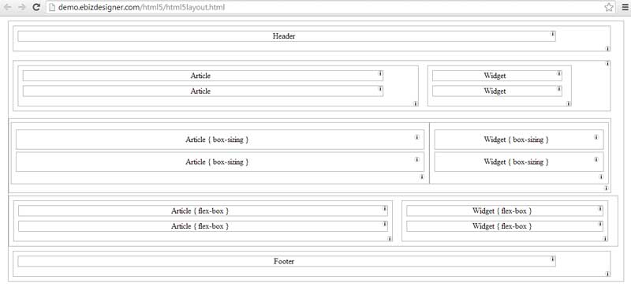
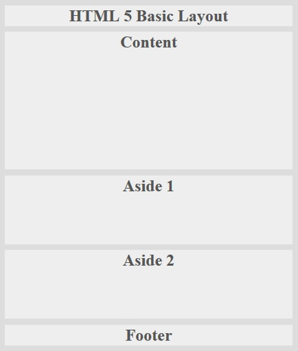
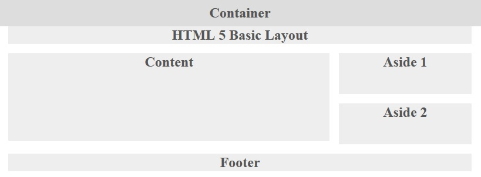

Basic-HTML-5-Layout
===================

This Repo is hoping to share all the secrets of Structure HTML 5 Basic Layout!
Notes: it's about how structring HTML 5 page Layout, not about Polish. Usually, all these Structure Divs would be hidden back of Decoration Divs.

Please click <a href="http://demo.ebizdesigner.com/html5/html5layout.html" target="_blank"> <b> here </b> </a>to see the online demo.

There THERE methods to make a basic HTML 5 Layout!
- Use left Floating Divs
- Use CSS 3 Box-Sizing
- Use CSS 3 Flex Box

We could find CSS 3 Flex Box would be the best 

One of the MOST tricky things working with nested floats is how we solve the Collapsed Container.

 </img>

In our code, we have three following solutions seperately:

- MANUALLY DIV METHOD is to manually append one empty div at the end of the last children div : 

- PSEODU DIV METHOD is use CSS Pseudo selector (:after) to automatically insert one empty div at the end of the last children div
- OVERFLOW METHOD is to set the Container's overflow attribute as 'auto' or 'hidden'

Details discussion please refer to CSS Guru's articles:
- <a href="http://css-tricks.com/all-about-floats/" target="_blank">All About Floats</a>
- <a href="http://www.positioniseverything.net/easyclearing.html" target="_blank">How To Clear Floats Without Structural Markup</a>

Another MOST tricky things working with nested floats is when set the width and height properties of an element with CSS, we just set the width and height of the Content area.

</img>

Suppose we have all our child components, like Content and Aside, have 1% margin, so the 68% (content) + 2% (left+right margin) + 28% (aside) + 2% (left+right margin) = 100% width.

Details discussion please refer to my post: <a href="http://www.ebizdesigner.com/website-building/css/item/48-responsive-floating-divs.html" target="_blank">Responsive Floating Divs</a>.
