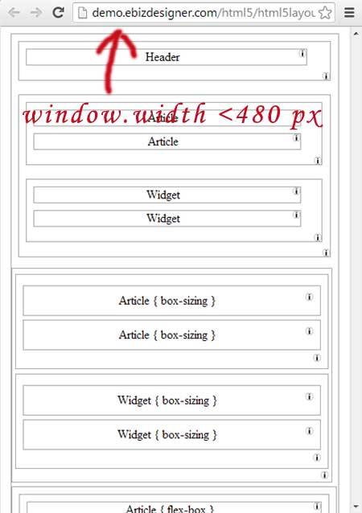

Basic-HTML-5-Layout
===================

Hand write clean code of one basic HTML 5 Basic Layout!

Please click <a href="" target="_blank"> <b> here </b> </a>to see the online demo.

 &nbsp;

One of the more tricky things working with nested floats is how we solve the Collapsed Container.

 </img>

In our code, we have three following solutions:

- MANUALLY DIV METHOD is to manually insert one blank div at the end of the last children div : 

- PSEODU DIV METHOD is use CSS Pseudo selector (:after) to automatically insert one empty div at the end of the last children div
- OVERFLOW METHOD is to set container's overflow attribute as 'auto' or 'hidden'
