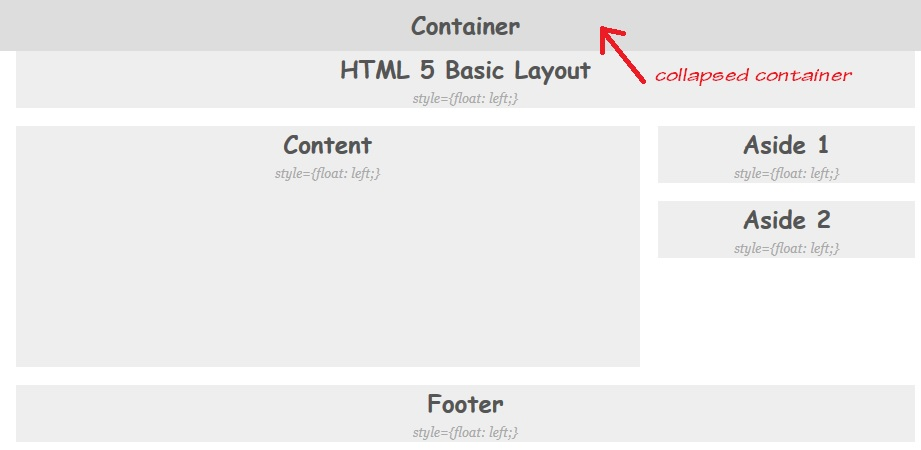
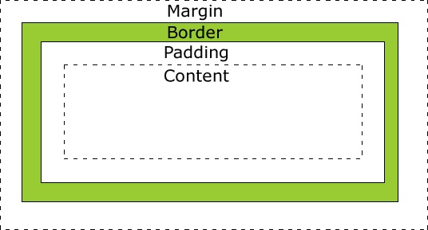

Basic-HTML-5-Layout
===================

This Repo is about the secrets of structuring one HTML 5 Basic Layout!
 Notes: it's about how framing the page, not polishing. We know, in production, all these framing Divs would be hidden with 0 margin and padding, and no border and background.

Please click <a href="http://demo.ebizdesigner.com/html5/html5layout.html" target="_blank"> <b> here </b> </a>to see the online demo.

Up to now, there are THERE way to frame one basic HTML 5 Layout (if you have any other methods, please Fork me)!
- Left Floating Divs
- CSS 3 Box-Sizing
- CSS 3 Flex Box

We could find the Flex Box would be the best choice to make the structure of page layout. 

In here, I summarize out all the key points of each method for your reference:
<h2>Left Floating Divs</h2>

<h3>Collapsed Container </h3>
One of the MOST tricky things working with nested floats is how we solve the Collapsed Container.
 </img>

In our code, you could find out we give out three solutions:

- MANUALLY DIV METHOD is to manually append one empty div at the end of the last children div : 

- PSEODU DIV METHOD is use CSS Pseudo selector (:after) to automatically insert one empty div at the end of the last children div
- OVERFLOW METHOD is to set the Container's overflow attribute as 'auto' or 'hidden'

Details discussion please refer to CSS Guru's articles:
- <a href="http://css-tricks.com/all-about-floats/" target="_blank">All About Floats</a>
- <a href="http://www.positioniseverything.net/easyclearing.html" target="_blank">How To Clear Floats Without Structural Markup</a>

<h3>Tricky Width</h3>
Another MOST tricky things working with nested floating Div components is when set the width and height properties of an element with CSS, we just set the width and height of the Content area.

</img>
 In order to auto stretch all children Divs along with and as well, being inside their parent container, we have to consider all the possible sizes of the parent.
 For example, as for the Header div, when the window's width is just 481px (this's the smallest possible width), in order to keep the Header div inside rather then overflow, it's content size must be smaller then 96%! That's for: 96% + 4% (=20px/481px) < 100% 
 Actually, all these framing Divs should be assigned as 0 margin and padding, and none border as well. In this case, we set them margin/padding and border just for we could see them.
 Details discussion please refer to my post: <a href="http://www.ebizdesigner.com/website-building/css/item/48-responsive-floating-divs.html" target="_blank">Responsive Floating Divs</a>.

<h2>CSS 3 Box-Sizing</h2>
When we use Div as Box-Sizing = border-box, the specified width and height (and min/max properties) on this element determine the border box of the element. That is, any padding or border specified on the element is laid out and drawn inside this specified width and height.
 In this case, we can set the child box's width = 100% and margin = 0, so as it can be always inside its container when stretching along with the window and its container. 
 I believe, this is just how this new CSS3 style making sense. While, you still have to assign it as one floating element.

<h2>CSS 3 Flex Box</h2>
The CSS 3 box-flex property specifies whether the child elements of a box is flexible or inflexible in size. Obviously, it's hoped to be a totally solution as for nested Divs. We don't need to use "float" property, and we just set the parent Div as flex box, and then, we define its children Div box. That's all.
